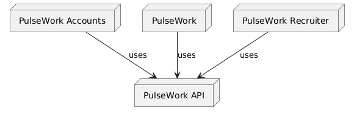

# Future- TODO
- migrate heroui to tailwindcss v4 (https://www.heroui.com/docs/guide/tailwind-v4)
- ensure members can also create jobs, but they can only view and manage jobs they own.
- ensure admins can view and edit all jobs, though.
- add export applicants to XLSX button
- add select option type applicant field
- add pagination to job view metrics (normal connections should be enough??)

- we need a separate resource that can return the searched jobs

- if prompt is show me jobs satisfying XXX conditions, we get a tool call done to call the appropriate jobs. we handle that and show the result client side.
- we can add other tools too, like showing current applications, saved jobs etc

# Hospital Jobs
> *recruitment and job seeking for medical professionals*

## Codebase Structure



<!-- 
relevant UML code:

https://www.planttext.com?text=u-LoA2v9B2efpStXvShBJqbLK0eepIbE3SylobPmJ4xEByqhALPII2nM20Xtn501bS3K6PIQN5IQMP9Q15KHnCk5nVW0Jx0qa0P90orGqDMr0t4Lh1HAYrEBGM91MCGmX1nIyrB0FW00
-->

| Service                 | Directory                                         | Description                      |
|-------------------------|---------------------------------------------------|----------------------------------|
| Hospital Jobs Accounts  | [apps/accounts](./apps/accounts)                  | Authentication/ Accounts UI      |
| Hospital Jobs Recruiter | [apps/recruitment-portal](./apps/recruiter-portal)| Recruitment platform UI          |
| Hospital Jobs           | [apps/seeker-portal](./apps/seeker-portal)        | Job Seeker platform UI           |
| Hospital Jobs API       | [server](./server)                                | GraphQL API Server               |
| E2E Test Suite          | [e2e](./e2e)                                      | Playwright End-To-End Tests      |
| Infrastructure          | [infrastructure](./infrastructure)                | Terraform Infrastructure as Code |


## License
This project has a proprietary license. Read the entire license [here](./README.md)


## Local development- Quickstart

### Prerequisites
| Tool                                                       | Minimum Tested Version  | Description                 |
|------------------------------------------------------------|-------------------------|-----------------------------|
| [Docker Engine](https://docs.docker.com/engine/)           | 4.35                    | Container runtime           |
| [TMUX](https://github.com/tmux/tmux)                       | 3.2a                    | Terminal Multiplexer        |
| [Tmuxinator](https://github.com/tmuxinator/tmuxinator)     | 3.0                     | TMUX session manager        |

Go through the setup guides of the services above, which covers installation of required dependencies,
and other service specific setup tasks.

To start all services in development, run the following command:

```bash
tmuxinator start medical_jobs
```

### Running E2E tests
1. Stop the currently running services:
    ```bash
    tmuxinator stop medical_jobs
    ```
2. Start the docker compose E2E services:
    ```bash
    docker compose -f docker-compose.e2e.yml up --wait --build --remove-orphans -d
    ```

3. Run the E2E tests:
    ```bash
    cd e2e
    pnpm run test
    ```


## Cloud deployment

### Prerequisites
- [Install the MongoDB Atlas CLI](https://www.mongodb.com/docs/atlas/cli/current/install-atlas-cli/)
- Copy the MongoDB Organization ID from the dashboard and store it in environment variables
- Run the follow commands to generate API keys:
    ```bash
    atlas organizations apiKeys create --role ORG_OWNER --desc "My API Key" --orgId <ORG_ID> --output json
    ```
- Store the public key and private key in environment variables

1. Log in to the AWS Management Console
Go to https://console.aws.amazon.com/

2. Go to the IAM Console
In the search bar, type IAM, and open IAM (Identity and Access Management).

3. Select a User or Create a New One
Go to Users in the sidebar.

Either:

Click the user you want to use with Terraform.

Or click "Add user" to create a new one.

💡 For Terraform use, the user should ideally have Programmatic access only.

4. Set Permissions
You can:

Attach existing policies directly (e.g., AdministratorAccess for testing, or fine-grained permissions for production).

Or add to a group with the necessary policies.

5. Create Access Keys
Click on the user → Security credentials tab.

Scroll down to Access keys section.

Click Create access key.

Choose Use access key for CLI, SDK, & API access.

Click Next, name it optionally, and then click Create access key.

Ensure the following policy is added to the user:
```json
{
	"Version": "2012-10-17",
	"Statement": [
		{
			"Effect": "Allow",
			"Action": [
				"ecr:*",
				"acm:DeleteCertificate",
				"sts:GetCallerIdentity",
				"iam:CreateRole",
				"iam:GetRole",
				"iam:ListRolePolicies",
				"iam:ListAttachedRolePolicies",
				"iam:ListPolicyVersions",
				"iam:AttachRolePolicy",
				"iam:PassRole",
				"iam:CreateUser",
				"iam:TagUser",
				"iam:CreatePolicyVersion",
				"iam:CreatePolicy",
				"iam:GetUser",
				"iam:DeleteUser",
				"iam:TagPolicy",
				"iam:ListGroupsForUser",
				"iam:ListAttachedUserPolicies",
				"iam:ListAccessKeys",
				"iam:CreateAccessKey",
				"iam:AttachUserPolicy",
				"iam:GetPolicy",
				"iam:GetPolicy",
				"iam:GetPolicyVersion",
				"iam:PutRolePolicy",
				"iam:GetRolePolicy",
				"iam:DeleteRolePolicy",
				"iam:DetachUserPolicy",
				"iam:CreateServiceLinkedRole",
				"ses:*",
				"secretsmanager:*",
				"s3:*",
				"geo:CreatePlaceIndex",
				"geo:DeletePlaceIndex",
				"geo:DescribePlaceIndex",
				"acm:RequestCertificate",
				"acm:DescribeCertificate",
				"acm:ListTagsForCertificate",
				"lambda:*",
				"ec2:CreateTags",
				"ec2:CreateVpc",
				"ec2:DescribeVpcs",
				"ec2:DescribeVpcAttribute",
				"ec2:AllocateAddress",
				"ec2:DescribeAddresses",
				"ec2:DescribeAddressesAttribute",
				"ec2:CreateInternetGateway",
				"ec2:AttachInternetGateway",
				"ec2:DeleteInternetGateway",
				"ec2:DescribeInternetGateways",
				"ec2:CreateRouteTable",
				"ec2:AssociateRouteTable",
				"ec2:DeleteRouteTable",
				"ec2:DescribeRouteTables",
				"ec2:CreateRoute",
				"ec2:DeleteRoute",
				"ec2:DeleteNatGateway",
				"ec2:CreateSecurityGroup",
				"ec2:AuthorizeSecurityGroupIngress",
				"ec2:AuthorizeSecurityGroupEgress",
				"ec2:RevokeSecurityGroupIngress",
				"ec2:RevokeSecurityGroupEgress",
				"ec2:DeleteSecurityGroup",
				"ec2:DescribeSecurityGroups",
				"route53:CreateHostedZone",
				"route53:GetHostedZone",
				"route53:ListTagsForResource",
				"route53:ListResourceRecordSets",
				"route53:ChangeResourceRecordSets",
				"route53:GetChange",
				"route53:DeleteHostedZone",
				"route53:ChangeTagsForResource",
				"ec2:DescribeSubnets",
				"ec2:DescribeInternetGateways",
				"ec2:DescribeSecurityGroups",
				"ec2:DescribeRouteTables",
				"ec2:DescribeVpcs",
				"ec2:DescribeNatGateways",
				"apigateway:*",
				"cloudfront:UpdateDistribution"
			],
			"Resource": "*"
		}
	]
}
```

- save the access key ID and secret key in the terraform cloud environment variables
- save the aws region in env vars

- run terraform apply
- update GoDaddy's NS records to the Route 53 nameservers midway, to ensure certificate validation takes place

- Generate a new Github access token and set it in the GITHUB_TOKEN env var in terraform cloud
	with following permissions:
	- secrets: read and write
	- variables: read and write

- Create a cloudflare API token and store it under env vars in terraform cloud (CLOUDFLARE_API_TOKEN)
- set the cloudflare account ID terraform variable
- Create a GCP project, and create Oauth 2.0 web credentials.
- set the `google_oauth_client_id` and `google_oauth_client_secret` terraform vars.
- Client config:
	- Authorized Javascript origins:
		- https://accounts.hospitaljobs.in
	- Authorized Redirect URIs:
		- https://api.hospitaljobs.in/auth/callback/signin/google
		- https://api.hospitaljobs.in/auth/callback/request_sudo_mode/google

- Project Branding config:
	- App name: Hospital Jobs
	- App Domain:
		- Application home page: https://hospitaljobs.in
		- Application privacy policy link: https://hospitaljobs.in/privacy
		- Application terms of service link: https://hospitaljobs.in/terms
	- Authorized domains:
		- hospitaljobs.in


## TODO: infrastructure
- wait for relevant tests to pass before building and pushing
- deploy frontends to Next.js to reduce latency (possibly using OpenNext)
	- https://github.com/nhs-england-tools/terraform-aws-opennext
	- https://github.com/opennextjs/opennextjs-aws
- update relevant CORS configuration in the backend
- update API Gateway CORS configuration
- remove background task for logging job view, use some other mechanism to asynchronously log the views.