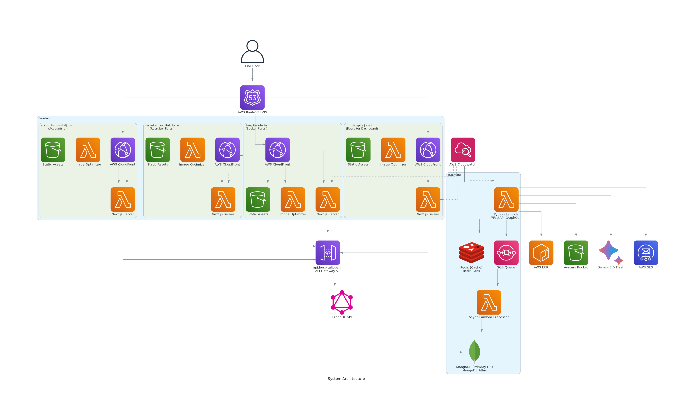

# Hospital Jobs
> *recruitment and job seeking for medical professionals*

[](https://github.com/pre-commit/pre-commit)
[](https://github.com/hospitaljobsin/hospitaljobsin/actions)

## Codebase Structure


<!--
relevant UML code:

https://www.planttext.com?text=u-LoA2v9B2efpStXvShBJqbLK0eepIbE3SylobPmJ4xEByqhALPII2nM20Xtn501bS3K6PIQN5IQMP9Q15KHnCk5nVW0Jx0qa0P90orGqDMr0t4Lh1HAYrEBGM91MCGmX1nIyrB0FW00
-->

| Service                             | Directory                                                   | Description                      |
|-------------------------------------|-------------------------------------------------------------|----------------------------------|
| Hospital Jobs Accounts              | [apps/accounts](./apps/accounts)                            | Authentication/ Accounts UI      |
| Hospital Jobs Recruiter Portal Core | [apps/recruitment-portal-core](./apps/recruiter-portal-core)| Recruitment platform UI          |
| Hospital Jobs Recruiter Dashboard   | [apps/recruitment-dashboard](./apps/recruiter-dashboard)    | Recruitment platform UI          |
| Hospital Jobs                       | [apps/seeker-portal](./apps/seeker-portal)                  | Job Seeker platform UI           |
| Hospital Jobs API                   | [server](./server)                                          | GraphQL API Server               |
| E2E Test Suite                      | [e2e](./e2e)                                                | Playwright End-To-End Tests      |
| Infrastructure                      | [infrastructure](./infrastructure)                          | Terraform Infrastructure as Code |

## System Architecture



## License
This project has a proprietary license. Read the entire license [here](./README.md)


## Local development- Quickstart

### Prerequisites
| Tool                                                           | Minimum Tested Version  | Description                           |
|----------------------------------------------------------------|-------------------------|---------------------------------------|
| [Docker Engine](https://docs.docker.com/engine/)               | 4.35                    | Container runtime                     |
| [TMUX](https://github.com/tmux/tmux)                           | 3.2a                    | Terminal Multiplexer                  |
| [Tmuxinator](https://github.com/tmuxinator/tmuxinator)         | 3.0                     | TMUX session manager                  |
| [Terraform](https://github.com/hashicorp/terraform)            | v1.12.1                 | Infrastructure as Code tool           |
| [Watchman](https://facebook.github.io/watchman/)               | 20250525.093350.0       | File watching service                 |
| [Relay Compiler](https://www.npmjs.com/package/relay-compiler) | 19.0.0                  | GraphQL Codegen Toolkit               |
| [Pre-Commit](https://pre-commit.com/)                          | 4.2.0                   | Git Hooks Framework                   |
| [MKCert](https://mkcert.dev/)                                  | 1.4.4                   | Locally trusted certificate generator |

Go through the setup guides of the services above, which covers installation of required dependencies,
and other service specific setup tasks.

#### 1. Setup Pre-Commit

To set up the git hook scripts, run the following command:

```bash
pre-commit install
```

#### 2. Setup Locally Trusted SSL Certificates

First, create a directory for your certificates and run mkcert to generate them:
```bash
mkcd certs
mkcert -install
mkcert -cert-file ./localtest.me.pem -key-file ./localtest.me-key.pem "localtest.me" "*.localtest.me"
```

This will generate:

- A certificate: `localtest.me.pem`

- A private key: `localtest.me-key.pem`

These are signed by a locally installed Root Certificate Authority (CA).

> ⚠️ Note: While this certificate is trusted within WSL and some development tools, browsers on Windows (Chrome, Edge, Firefox) won’t trust it until the Root CA is added to Windows’ trust store.

To make Windows-based browsers trust the generated certificate:

Open the mkcert CA root directory in Windows File Explorer:
```bash
cd "$(mkcert -CAROOT)"
explorer.exe .
```
- Locate the `rootCA.pem` file (you may need to rename it to `rootCA.crt` for compatibility).
- Double-click the file to open the Certificate Information window.
- Click "Install Certificate…".
- Choose “Local Machine” (requires admin access) or “Current User”.
- Select:
	- Place all certificates in the following store
	- Click Browse
	- Choose Trusted Root Certification Authorities
- Complete the wizard by clicking Next → Finish.
- Restart your browser(s) for the changes to take effect.


#### 3. Run Development Services
To start all services in development, run the following command:

```bash
tmuxinator start medical_jobs
```


### Running E2E tests
1. Stop the currently running services:
    ```bash
    tmuxinator stop medical_jobs
    ```
2. Start the docker compose E2E services:
    ```bash
    docker compose -f docker-compose.e2e.yml up --wait --build --remove-orphans -d
    ```

3. Run the E2E tests:
    ```bash
    cd e2e
    pnpm run test
    ```


## Cloud deployment

Follow these steps to deploy the project to the cloud:

### 1. MongoDB Atlas Setup
- [Install the MongoDB Atlas CLI](https://www.mongodb.com/docs/atlas/cli/current/install-atlas-cli/)
- Setup Payment Method
- Copy the MongoDB Organization ID from the dashboard and store it in environment variables
- Run the follow commands to generate API keys:
    ```bash
    atlas organizations apiKeys create --role ORG_OWNER --desc "My API Key" --orgId <ORG_ID> --output json
    ```

### 2. AWS Account Setup
- [Log in to the AWS Management Console](https://console.aws.amazon.com/)
- Create a new AWS account/ log into an existing account
- Create a new IAM user (to be used by terraform)
- Add the `"arn:aws:iam::aws:policy/AdministratorAccess"` managed IAM policy to the user

<!--
- Attach the following permissions (inline policy) to the IAM user:
```json
{
	"Version": "2012-10-17",
	"Statement": [
		{
			"Effect": "Allow",
			"Action": [
				"ecr:*",
				"logs:*",
				"acm:DeleteCertificate",
				"sts:GetCallerIdentity",
				"iam:ListInstanceProfilesForRole",
				"iam:CreateRole",
				"iam:GetRole",
				"iam:ListRolePolicies",
				"iam:ListAttachedRolePolicies",
				"iam:ListPolicyVersions",
				"iam:AttachRolePolicy",
				"iam:DeleteRole",
				"iam:PassRole",
				"iam:CreateUser",
				"iam:TagUser",
				"iam:CreatePolicyVersion",
				"iam:CreatePolicy",
				"iam:GetUser",
				"iam:DeleteUser",
				"iam:DeletePolicy",
				"iam:TagPolicy",
				"iam:ListGroupsForUser",
				"iam:ListAttachedUserPolicies",
				"iam:ListAccessKeys",
				"iam:CreateAccessKey",
				"iam:AttachUserPolicy",
				"iam:GetPolicy",
				"iam:GetPolicyVersion",
				"iam:PutRolePolicy",
				"iam:GetRolePolicy",
				"iam:DeleteRolePolicy",
				"iam:DetachUserPolicy",
				"iam:CreateServiceLinkedRole",
				"ses:*",
				"secretsmanager:*",
				"s3:*",
				"geo:CreatePlaceIndex",
				"geo:DeletePlaceIndex",
				"geo:DescribePlaceIndex",
				"acm:RequestCertificate",
				"acm:DescribeCertificate",
				"acm:ListTagsForCertificate",
				"lambda:*",
				"ec2:*",
				"route53:CreateHostedZone",
				"route53:GetHostedZone",
				"route53:ListTagsForResource",
				"route53:ListResourceRecordSets",
				"route53:ChangeResourceRecordSets",
				"route53:GetChange",
				"route53:DeleteHostedZone",
				"route53:ChangeTagsForResource",
				"apigateway:*",
				"cloudfront:UpdateDistribution"
			],
			"Resource": "*"
		}
	]
}
``` -->

- Create Access Keys for the user (choose  access key for CLI, SDK, & API access)

### 3. Google Oauth2 Setup
- [Go to the google cloud console](https://console.cloud.google.com/)
- Create/ select a new project
- Configure the Oauth consent screen
- Go to "APIs & Services" > "Credentials", and create new Oauth 2.0 Credentials
- While creating the credentials, fill in the following information:
	- **Client config:**
		- *Authorized Javascript origins:*
			- https://accounts.hospitaljobs.in
		- *Authorized Redirect URIs:*
			- https://api.hospitaljobs.in/auth/callback/signin/google
			- https://api.hospitaljobs.in/auth/callback/request_sudo_mode/google

	- **Project Branding config:**
		- *App name:* Hospital Jobs
		- *App Domain:*
			- *Application home page:* https://hospitaljobs.in
			- *Application privacy policy link:* https://hospitaljobs.in/privacy
			- *Application terms of service link:* https://hospitaljobs.in/terms
		- *Authorized domains:*
			- hospitaljobs.in

### 4. Cloudflare Setup
- [Go to the Cloudflare dashboard](https://dash.cloudflare.com/)
- Login to your cloudflare account
- Under Manage Account / Account tokens, click on "Create Token"

### 5. GitHub Setup
- [Go to GitHub developer settings](https://github.com/settings/tokens)
- Create a new GitHub access token with permissions for the current repository:
	- *secrets: read and write*
	- *variables: read and write*

### 6. Sentry Setup
- Create a new organization
- [Install the Sentry GitHub Integration](https://docs.sentry.io/organization/integrations/source-code-mgmt/github/#installing-github) (repository linking is automated)
- [Create a Sentry Authentication Token](https://docs.sentry.io/organization/integrations/integration-platform/internal-integration/#auth-tokens) (via an internal integration)

### 7. Serper Setup
- Go to the [Serper Dashboard](https://serper.dev/dashboard)
- Create an API key


### 8. Redis Cloud Setup
- Go to the [Redis Cloud Console](https://console.redis.io)
- Configure a payment method
- Enable programmatic access to the cloud console (Under Access Management > API Keys)
- Create an API key (AKA Secret Key)
- Copy the Account Key (AKA Access Key) and API Key (AKA Secret Key)

### 9. Terraform Setup

#### 9.1 Prerequisites:
- Create an S3 bucket that will act as the terraform state backend

Terraform deployments are automated via GitHub Actions CI/CD.
the following GitHub actions variables and secrets need to be set to enable deployments:

GitHub Actions Variables:
- `TERRAFORM_AWS_BACKEND_BUCKET_NAME`
- `TERRAFORM_AWS_REGION`
- `CLOUDFLARE_ACCOUNT_ID`
- `MONGODB_ATLAS_ORG_ID`

GitHub Actions Secrets:
- `TERRAFORM_AWS_ACCESS_KEY_ID`
- `TERRAFORM_AWS_SECRET_ACCESS_KEY`
- `CLOUDFLARE_API_TOKEN`
- `PA_TOKEN_GITHUB`
- `MONGODB_ATLAS_PRIVATE_KEY`
- `MONGODB_ATLAS_PUBLIC_KEY`
- `GOOGLE_OAUTH_CLIENT_ID`
- `GOOGLE_OAUTH_CLIENT_SECRET`
- `GOOGLE_GEMINI_API_KEY`
- `SENTRY_AUTH_TOKEN`
- `SERPER_API_KEY`
- `REDISCLOUD_SECRET_KEY`
- `REDISCLOUD_ACCESS_KEY`


During the initial terraform deployment:
- update the domain registrar (GoDaddy/ NameCheap/ Google Domains)'s NS records to the Route 53 nameservers midway, to ensure certificate validation takes place

After automated deployment, you need to:
- Request SES production access manually on AWS
- Join the created team on sentry with your account
